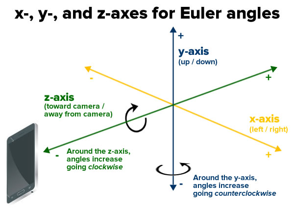

# ICam
An android app demonstrating sample usage of AR and ML in mobile tech

## Part 1
The first mile stone was on creating snapchat like filter that draws custom objects in realtime, on a persons face.
This was accomplished by the use of google's mobile vision library that eases face detection, facial landmark detections and face tracking
### facial landmark detections
<div>
	
	<br>
</div>

### face tracking
<div>
	
</div>

```a more detailed tutorial on google's mobile vision can be found at``` [tutorial](https://www.raywenderlich.com/523-augmented-reality-in-android-with-google-s-face-api#toc-anchor-012)

## Part 2
In this section, we demonstrate the use of ***Machine Learning*** on top of machine learning: ```google's mobile vision is already an AI library```
As an attempt to add more flavor to AR, we employed ML in facial emotion detection. 
<p><em>Tensorflow was our choice framework for ML.</em></p>
the model, CNN, is trained using tensorflow python framework, saved and then the resulting graph is fed in to the apk.
<br>

``input_image->conv2d->pooling->conv2d->pooling->dropout->softmax``

***Dataset*** is collected from facial expression recognition challange in [Kaggle](https://www.kaggle.com/c/challenges-in-representation-learning-facial-expression-recognition-challenge/)
The data consists of 48x48 pixel grayscale images of faces.The dataset contains facial expression of seven categories ```0=Angry, 1=Disgust, 2=Fear, 3=Happy, 4=Sad, 5=Surprise, 6=Neutral```

## possible improvements
- fix model overfitting
- migrate to tensorflow mobile lite which is optimized for improved performance and reduced apk size


## Pending tasks
- <p><em>Face center crop faces from raw image before feeding to CNN model</em></p>
- <p><em>Rectify model overfitting and apply image augmentation and boost accuracy from 50% which is extreemly low</em></p>
- <p><em>Stream line integration of our ml model with face tedector model</em></p>


